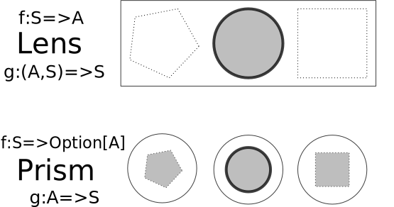

# Swinging cats with monocles

Isaias Bartelborth

Github: https://github.com/isaias-b

---

## Agenda

* Motivation: Why to use lenses or optics?
* Optics: What does Monocle offer us?
* Integration: How to use it with cats?
* Example: Small Swing application.

---

### Why to use lenses or optics?

Lenses facilitate drill down into product shaped types.
In essence a lens only does function composition.

Challenge: Can we do that manually?

Let's see!

----

### Classical Example

<pre><code class="scala trim strip-margin" data-line-numbers="6,11">case class Street(name: String, number: Int)
case class Address(city: String, street: Street)
case class Person(fullName: String, address: Address)

val person: Person = Person("Max Muster",
  Address("Cologne", Street("neumarkt", 123))

person.copy(
  address = person.address.copy(
    street = person.address.street.copy(
      name = person.address.street.name.capitalize
    )
  )
)
</code></pre>

Copy functions are tedious to write.
Start extracting those first then reuse em.

----

### Extract copy methods

Copy methods can be created for each field on the associated companion object.

```scala
object Person {
  val setAddress: Person => Address => Person =
    p => x => p.copy(address = x)
}
object Address {
  val setStreet: Address => Street => Address =
    p => x => p.copy(street = x)
}
object Street {
  val setName: Street => String => Street =
    p => x => p.copy(name = x)
}
```

----

### Use setters instead

----

<!-- .slide: data-transition="fade" -->

### Use setters instead (Before)

```scala
person.copy(
  address = person.address.copy(
    street = person.address.street.copy(
      name = person.address.street.name.capitalize
    )
  )
)
```

.

.

----

<!-- .slide: data-transition="fade" -->

### Use setters instead (After)

```scala
Person.setAddress(person)(
  Address.setStreet(person.address)(
    Street.setName(person.address.street)(
      person.address.street.name.capitalize
    )
  )
)
```

No copy methods left. \o/

Now remove the function cascade.

----

### Unfold function cascade
```scala 
val n = person.address.street.name.capitalize
val s = Street.setName(person.address.street)(n)
val a = Address.setStreet(person.address)(s)
Person.setAddress(person)(a)
```

Cleaner, but still a lot of repetition.

----

### Extract variables
<pre><code class="scala trim" data-line-numbers="3-5">val a1 = person.address
val s1 = a1.street
val n1 = s1.name                // s1: Street comes in
val n2 = n1.capitalize          // capitalize: String => String
val s2 = Street.setName(s1)(n2) // s2: Street comes out
val a2 = Address.setStreet(a1)(s2)
Person.setAddress(person)(a2)
</code></pre>

Here is an opportunity to extract a function that operates on a street's name.

----

### Extract `modifyStreet`

```scala 
def modifyStreet(s: Street)(f: String => String): Street = {
  val n1 = s.name          // getName: Street => String
  val n2 = f(n1)
  Street.setName(s)(n2)    // setName: Street => String => Street
}
```

Cool, but let's return a function instead and try to pass in the getter and setter for the street's name.

----

### Abstract `modifyStreet`

```scala 
def modifyStreet1
  ( get: Street => String
  , set: Street => String => Street
  )
  ( f: String => String )
  : Street => Street 
  = s => {
    val n1 = get(s)
    val n2 = f(n1)
    set(s)(n2)
  }
```

Now this function is very generic. It is independent of the actual types. Let's parameterize it.

----

### Parameterize into `modify`

```scala 
def modify[S, A]
  ( get: S => A
  , set: S => A => S
  )
  ( f: A => A )
  : S => S 
  = s => {
    val a1 = get(s)
    val a2 = f(a1)
    set(s)(a2)
  }
```

In essence this function allows us to lift any other function with the shape of `A => A`
into a function of same shape but different type `S => S`. That is useful!

----

### Envision a target

```scala 
val modName:    String  => String  = _.capitalize
val modStreet:  Street  => Street  = ???
val modAddress: Address => Address = ???
val modPerson:  Person  => Person  = ???
modPerson(person)
```

----

### Use `modify`

```scala 
import Street.setName // and others...

val a1 = person.address
val s1 = a1.street
val s2 = modify[Street, String](_.name, setName)(_.capitalize)(s1)
val a2 = Address.setStreet(a1)(s2)
Person.setAddress(person)(a2)
```

Nice. Ok let's move on!

----

### Refactor into function values

```scala 
val a1 = person.address
val s1 = a1.street
val modName:    String => String = _.capitalize
val modStreet:  Street => Street =
  modify[Street, String](_.name, Street.setName)(modName)
val a2 = Address.setStreet(a1)(modStreet(s1))
Person.setAddress(person)(a2)
```

Now treat modification of address and person the same way.

----

### Refactor modification of address and person

```scala 
val modName:    String  => String  = _.capitalize
val modStreet:  Street  => Street  =
  modify[Street, String](_.name, Street.setName)(modName)
val modAddress: Address => Address =
  a => Address.setStreet(a)(modStreet(a.street))
val modPerson:  Person  => Person  =
  p => Person.setAddress(p)(modAddress(p.address))
modPerson(person)
```

Pattern of `modify` starts to emerge, so let's reuse it again.

----

### Refactor modification of address and person

```scala 
val modName:    String  => String  = _.capitalize
val modStreet:  Street  => Street  =
  modify[Street, String](_.name, setName)(modName)
val modAddress: Address => Address =
  modify[Address, Street](_.street, setStreet)(modStreet)
val modPerson:  Person  => Person  =
  modify[Person, Address](_.address, setAddress)(modAddress)
modPerson(person)
```

This works, but unfortunately is still very tedious to write and read.

----

### Ideal solution

Ideally we would be able to modify a nested element without having to chain functions ourselves.
```scala 
modify[Person, String](???, ???)(_.capitalize)(person)
```

For this we need composition of getters and setters.

----

### Compose getters and setters

For getters this is just plain function composition.

```scala 
def composeGetters[S,A,B]
  ( getA: S => A
  , getB: A => B
  )
  : S => B 
  = getB.compose(getA)
```

Let's try to do this the same way for setters...

----

### Attempt to compose setters

We need to aggregate all inputs to produce valid results.

```scala 
def composeSettersX[S,A,B]
  ( setA: S => A => S
  , setB: A => B => A
  )
  : S => B => S 
  = s => b => ???
```

However, there is no way where can we put our given b into.
Only setB takes a b, but setB requires an A.
Unfortunately there is no way to get an A.

==> impossible to implement

----

### Compose setters

Any ideas??

```scala 
def composeSetters[S,A,B]
  ( setA: S => A => S
  , setB: A => B => A
  , getA: S => A
  )
  : S => B => S 
  = s => b => {
    val a1 = getA(s)
    val a2 = setB(a1)(b)
    setA(s)(a2)
  } // inlined: setA(s)(setB(getA(s))(b))
```

Setter composition requires a getter 😲

----

### Use composition of setters and getters

```scala 
val setNameA = composeSetters[Address, Street, String](
  Address.setStreet, Street.setName, _.street
)
val setNameP = composeSetters[Person, Address, String](
  Person.setAddress, setNameA, _.address
)
val getNameA = composeGetters[Address, Street, String](
  _.street, _.name
)
val getNameP = composeGetters[Person, Address, String](
  _.address, getNameA
)
modify[Person, String](getNameP, setNameP)(_.capitalize)(person)
```

SUCCESS, but still very clumpsy and even repetitive.

----

### Container for getter and setter

```scala 
case class Lens[S, A](get: S => A, set: S => A => S) {
  def modify(f: A => A): S => S = s => {
    val a1 = get(s)
    val a2 = f(a1)
    set(s)(a2)
  }
  def compose[B](lb: Lens[A, B]): Lens[S, B] = Lens[S, B](
    s =>      lb.get(get(s)),            // getter composition
    s => b => set(s)(lb.set(get(s))(b))  // setter composition
  )
}
```

For now our Lens is just a container for a set and a get operation.

----

### Use `Lens`

```scala 
Lens[Person, Address](_.address, Person.setAddress)
  .compose(Lens[Address, Street](_.street, Address.setStreet))
  .compose(Lens[Street, String](_.name, Street.setName))
  .modify(_.capitalize)(person)
```

This seems to be like the abstraction we were looking for.

----

### Extract lenses

```scala
object Person {
  val setAddress: Person => Address => Person =
    p => x => p.copy(address = x)
  val address: Lens[Person, Address](_.address, setAddress)
}
object Address {
  val setStreet: Address => Street => Address =
    p => x => p.copy(street = x)
  val street: Lens[Address, Street](_.street, setStreet)
}
object Street {
  val setName: Street => String => Street =
    p => x => p.copy(name = x)
  val name: Lens[Street, String](_.name, setName)
}
```

----

### Use extracted lenses

----

<!-- .slide: data-transition="fade" -->

### Use extracted lens (Before)

```scala 
Lens[Person, Address](_.address, Person.setAddress)
  .compose(Lens[Address, Street](_.street, Address.setStreet))
  .compose(Lens[Street, String](_.name, Street.setName))
  .modify(_.capitalize)(person)
```

----

<!-- .slide: data-transition="fade" -->

### Use extracted lens (After)

```scala 
Person.address
  .compose(Address.street)
  .compose(Street.name)
  .modify(_.capitalize)(person)
```

---

## What does Monocle offer us?

* Different optics: Lens, Prism, Iso, Optional...
* Mature optics model
* Correct implementation with good performance
* Law based testing for custom optics
* Various composition patterns
* Many ways to derive optics
* Integrates with: cats
* Reduce boilerplate code from O(n²) to O(n)

----

### Use generated `Lens`

```scala
import monocle.macros.{GenLens, Lenses}
import monocle.macros.syntax.lens._

@Lenses case class Street(name: String, number: Int)
@Lenses case class Address(city: String, street: Street)
@Lenses case class Person(fullName: String, address: Address)

val person: Person = Person("Max Mustermann",
  Address("Cologne", Street("neumarkt", 123))
)

Person.address
  .composeLens(Address.street)
  .composeLens(Street.name)
  .modify(_.capitalize)(person)
```

WOW, pretty neat!

----

### Ways to generate `Lens`

Generate `Lens` instances by using the:

* `@Lenses` macro annotation
* `GenLens` with a projection to an inner field
* ⚠️ Constructor with `get` and `set` functions

The last option provides the least safety. Verify Validity!

----

### `Lens` Laws

```scala
// monocle.law.discipline.LensTests
// monocle.law.LensLaws
new SimpleRuleSet("Lens",
  "set what you get"                -> forAll(???),
  // lens.set(lens.get(s))(s) <==> s
  "get what you set"                -> forAll(???),
  // lens.get(lens.set(a)(s)) <==> a
  "set idempotent"                  -> forAll(???),
  // lens.set(a)(lens.set(a)(s)) <==> lens.set(a)(s)
  "modify id = id"                  -> forAll(???),
  "compose modify"                  -> forAll(???),
  "consistent set with modify"      -> forAll(???),
  "consistent modify with modifyId" -> forAll(???),
  "consistent get with modifyId"    -> forAll(???)
)
```

----

### Cheat Sheet: `Lens`

```scala
case class Lens[S, A](
  get: S => A,         // focus always succeeds, but is lossy
  set: A => S => S     // that's why unfocus requires extra S
)
```

* Focuses on one field inside product type
* Must obey `Lens` Laws to be valid
* Replaces copy methods

----

### Optics overview


----

### Cheat Sheet: `Prism`

```scala
case class Prism[S, A](
  getOption: S => Option[A], // focus may fail, but is not lossy
  reverseGet: A => S         // unfocus never requires extra S
)
```

* Focuses on one member of a sum type
* Must obey `Prism` Laws to be valid
* Replaces match case expressions
* Alternative to typesafe downcasts
* Relates to apply and unapply

----

### Ways to generate `Prism`

* Predefined instances at `monocle.std.`:
  * `option.some`
  * `either.stdRight`
  * `either.stdLeft`
* `GenPrism` with a base- to subtype relation
* ⚠️ Constructor with `getOption` and `reverseGet` functions

The last option provides the least safety. Verify validity!

----

### Given a non-trivial`Prism`

```scala
object MyOptics {
  def list2mapGetter[A]: Getter[List[A], Map[Int, A]] =
    Getter(l => l.zipWithIndex.map(_.swap).toMap)
  def map2ListGetter[A]: Getter[Map[Int, A], List[A]] =
    Getter(m => m.toList.sortBy(_._1).map(_._2))

  def map2listPrism[A]: Prism[Map[Int, A], List[A]] =
    Prism[Map[Int, A], List[A]]{ m =>
      if (m.isEmpty) Some(List.empty)
      else if (m.size == (m.keys.max + 1) && m.keys.min == 0)
        Some(map2ListGetter[A].get(m))
      else
        None
    }(l => list2mapGetter[A].get(l))
}
```

----

### Setup test harness

```scala
import cats.kernel.Eq
import monocle.function.GenericOptics
import monocle.law.discipline.PrismTests
import monocle.std.StdInstances
import monocle.syntax.Syntaxes
import org.scalatest.{FunSuite, Matchers}
import org.typelevel.discipline.scalatest.Discipline
```

----

### Test your `Prism`

```scala
class MySpec extends FunSuite with Discipline with Matchers
    with StdInstances with GenericOptics with Syntaxes {
  implicit val eqListInt: Eq[List[Int]]    = Eq.fromUniversalEquals
  implicit val eqMapInt: Eq[Map[Int, Int]] = Eq.fromUniversalEquals
  checkAll("map2listPrism", PrismTests(MyOptics.map2listPrism[Int]))
}
```

----

### `Prism` Laws

```bash
$ sbt test
...
[info] MySpec:
[info] - map2listPrism.Prism.compose modify
[info] - map2listPrism.Prism.consistent getOption with modifyId
[info] - map2listPrism.Prism.consistent modify with modifyId
[info] - map2listPrism.Prism.consistent set with modify
[info] - map2listPrism.Prism.modify id = id
[info] - map2listPrism.Prism.partial round trip one way
[info] - map2listPrism.Prism.round trip other way
[info] NextSpec:
...
```

----

### `Prism` Laws

```scala
// monocle.law.discipline.PrismTests
// monocle.law.PrismLaws
new SimpleRuleSet("Prism",
  "partial round trip one way"          -> forAll(???),
  // prism.getOrModify(s).fold(identity, prism.reverseGet) <==> s
  "round trip other way"                -> forAll(???),
  // prism.getOption(prism.reverseGet(a)) <==> Some(a)
  "modify id = id"                      -> forAll(???),
  // prism.modify(identity)(s) <==> s
  "compose modify"                      -> forAll(???),
  "consistent set with modify"          -> forAll(???),
  "consistent modify with modifyId"     -> forAll(???),
  "consistent getOption with modifyId"  -> forAll(???)
)
```

----

### Composition Basics

* Two optics of same kind mostly produce a new composed optic of this exact same kind.
* Two optics of different kind will only produce a composed optic of weaker kind, if possible.
  * If both optics share a weaker supertype, then the composed optic will be of kind of the closest supertype.
  * If both optics don't share a weaker supertype, then the composed optic doesn't exist in general.

----

### Weaker top & stronger bot


----

### Operators or functions

Most of the time neither, set nor get is used directly.
Instead one of the more high level operators is being used when using optics.

```scala
trait Modify[S, A] {
  def modify(f: A => A): S => S
}
trait ModifyF[S, A] {
  def modifyF[F[_]: Applicative](f: A => F[A]): S => F[S]
}
```

----

### `modify` and `modifyF`

----

<!-- .slide: data-transition="fade" -->

### `modify`


----

<!-- .slide: data-transition="fade" -->

### `modifyF`


----



----


---

## Moncle with cats

----

### Use cases for cats

* Use `Traverse` to turn things inside out.
* Monocle is built with cats.
* `modifyF` requires an `Applicative`.
* `IO` is actually an `Applicative`.

----

### Use cases for cats-effect

* Encapsulate side effects in `IO`.
* Switch between thread pools with `ContextSwitch`.
* Timing can be done with `Timer`.
* Start off new asynchronous operations as `Fiber`s.
* Share state concurrently with `MVar` and `Ref`.
* Reliably harvest `Resource`s that are safe to use.

----

### `IO` and `modifyF`

----

<!-- .slide: data-transition="fade" -->

### `IO` and `modifyF`

```scala
// def modifyF[F[_]: Applicative](f: A => F[A]): S => F[S]
import cats.effect._
import monocle.Prism
import scala.concurrent.duration._
import cats.effect.IOApp

trait App extends IOApp {
  val fetch: Int => IO[Int] = input =>
    IO.sleep(2.seconds).map(_ => input + 1)
  val prism: Prism[Option[Int], Int] = monocle.std.option.some
  val computeNextOpt  /* ???????????????????????? */ =
    prism.modifyF(fetch)
}
```

----

<!-- .slide: data-transition="fade" -->

### `IO` and `modifyF`

```scala
// def modifyF[F[_]: Applicative](f: A => F[A]): S => F[S]
import cats.effect._
import monocle.Prism
import scala.concurrent.duration._
import cats.effect.IOApp

trait App extends IOApp {
  val fetch: Int => IO[Int] = input =>
    IO.sleep(2.seconds).map(_ => input + 1)
  val prism: Prism[Option[Int], Int] = monocle.std.option.some
  val computeNextOpt: Option[Int] => IO[Option[Int]] =
    prism.modifyF(fetch)
}
```

----

### Traverse over `Option` with `IO`

----

<!-- .slide: data-transition="fade" -->

### Traverse over `Option` with `IO`

```scala
//no optics, just cats
import cats.effect._
import cats.syntax.traverse._
import cats.instances.option._
import scala.concurrent.duration._
import cats.effect.IOApp

trait App extends IOApp {
  val fetch: Int => IO[Long] =
    input => IO.sleep(2.seconds).map(_ => input + 1)
  val optId: Option[Int]      = Some(123)
  val optIo: Option[IO[Long]] = optId.map(fetch)
  val ioOpt  /* ?????????? */ = optId.traverse(fetch)
}
```

----

<!-- .slide: data-transition="fade" -->

### Traverse over `Option` with `IO`

```scala
//no optics, just cats
import cats.effect._
import cats.syntax.traverse._
import cats.instances.option._
import scala.concurrent.duration._
import cats.effect.IOApp

trait App extends IOApp {
  val fetch: Int => IO[Long] =
    input => IO.sleep(2.seconds).map(_ => input + 1)
  val optId: Option[Int]      = Some(123)
  val optIo: Option[IO[Long]] = optId.map(fetch)
  val ioOpt: IO[Option[Long]] = optId.traverse(fetch)
}
```

---

## Resources & References
* [Monocle](https://julien-truffaut.github.io/Monocle/learning_resources.html) Learning Resources.
* [Monocle](https://www.scala-exercises.org/monocle/iso) Scala exercises.
* [Monocle](https://gitter.im/julien-truffaut/Monocle) Gitter channel.
* [Cats](https://typelevel.org/cats/) FP key concepts.
* [Cats-Effect](https://typelevel.org/cats-effect/datatypes/) IO Monad.
* [Radiance](https://github.com/kirill-grouchnikov/radiance) Substance Look & Feel.
* [JSerialComm](https://fazecast.github.io/jSerialComm/) Portable serial communication.

---

## Demo


Source: https://github.com/isaias-b/serial-monitor/tree/DEMO-2019-06-18

---

## Conclusion

Just a few key takeaways:

* Avoid `get/set/copy` methods.
* Prefer `modify` and `modifyF`.
* Refactor existing projects or start a new one ;)

---

## Thank You!

Slides: https://github.com/isaias-b/monocle-talk  

